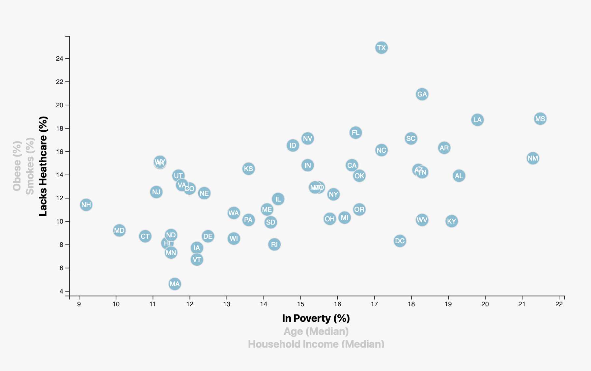

# Medical Analysis

        

## Introduction

This project was done to give a bigger view on the relationship between common problems in the US which are smoking, obesity, lacks heathcare and age as well as the average age of US citizens.

The graph as well as the conclusions can be consulted here -> [Medical Analysis](https://enr1que319.github.io/D3-Challenge/)

### Tools

The following tools were used to do the analysis:

- HTML5
- CSS
- JavaScript
- D3

The platform used to mount the web page is Github

## Data

The information used was provided by Tecnológico de Monterrey and it is in CSV format, you can see the schema below

#### Schema

|  Column  | Data Type |
| -------- | ----------|
|    id    | `Integer` |
|   state  |   `String`  |
|   abbr   |   `String`  |
| poverty  |  `Float`  |
|   povertyMoe   |  `Float`  |
|   age   |  `Float`  |
|   ageMoe   |  `Float`  |
|   income   |  `Integer`  |
|   incomeMoe   |  `Integer`  |
|   healthcare   |  `Float`  |
|   healthcareLow   |  `Float`  |
|   healthcareHigh   |  `Float`  |
|   obesity   |  `Float`  |
|   obesityLow   |  `Float`  |
|   obesityHigh   |  `Float`  |
|   smokes   |  `Float`  |
|   smokesLow   |  `Float`  |
|   smokesHigh   |  `Float`  |

## Analysis

A scatter plot was developed which shows different variables that are:

- Obese
- Smokes
- Lacks Healthcare
- Poverty
- Age
- Household

The objective was to find a relationship between these variables by doing an analysis with the information that was available.

   

#### Results

- It can be noted that there is a relationship of 4 variables that are: poverty, obesity, smoking and medical care since the states that have the highest poverty rates also have the highest rates of the other 3 variables. With this we can say that the correlation of these variables with the median of households and income by state is negative.
- We can also observe that there is a positive correlation in the poverty rate with respect to the 3 risk factors analyzed
- Regarding smoking, we found a positive correlation with the Middle Ages of the states which were analyzed, more information would be needed to be able to approve or reject the aforementioned hypotheses

